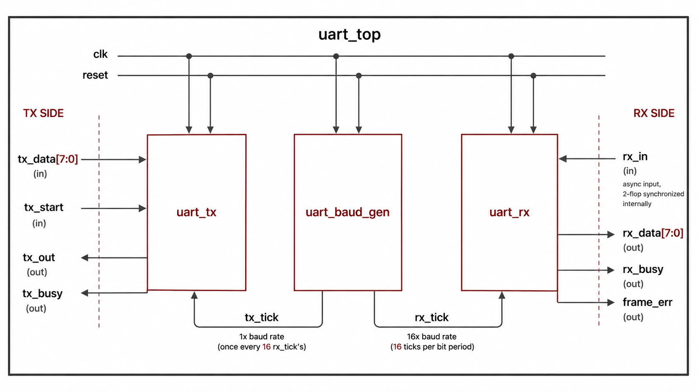
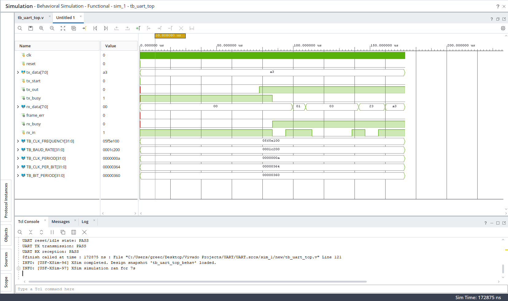
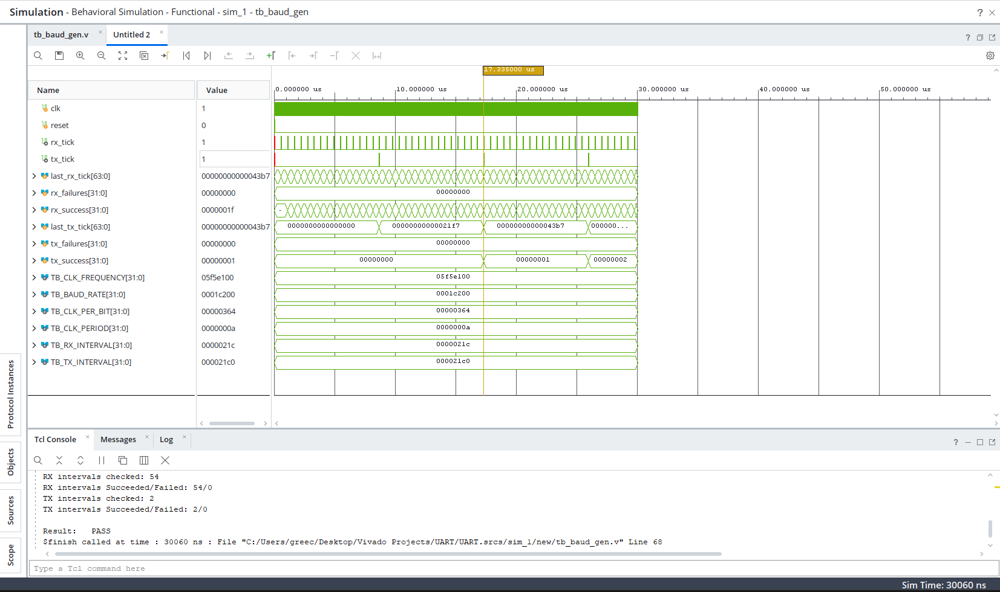
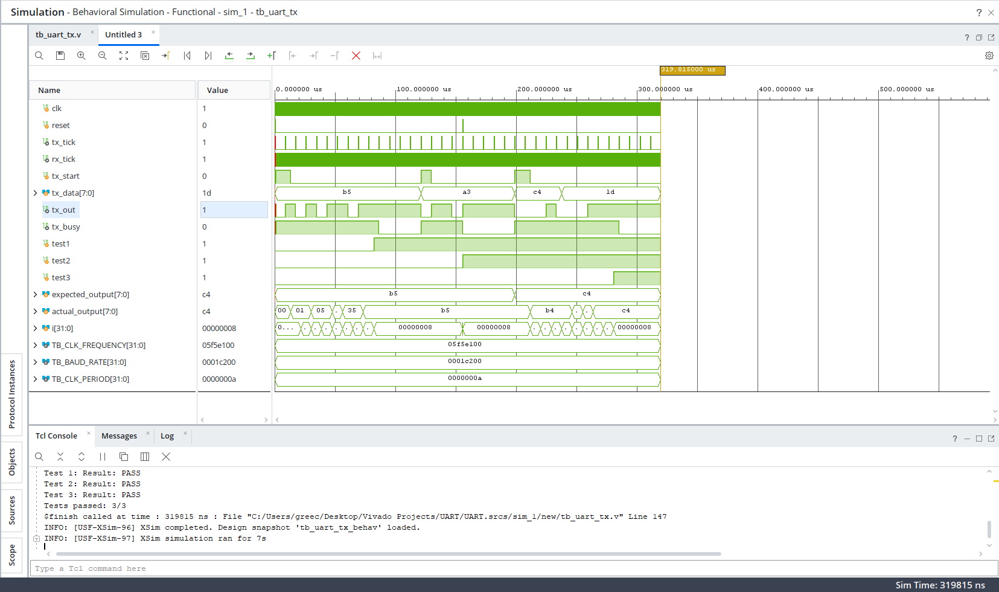
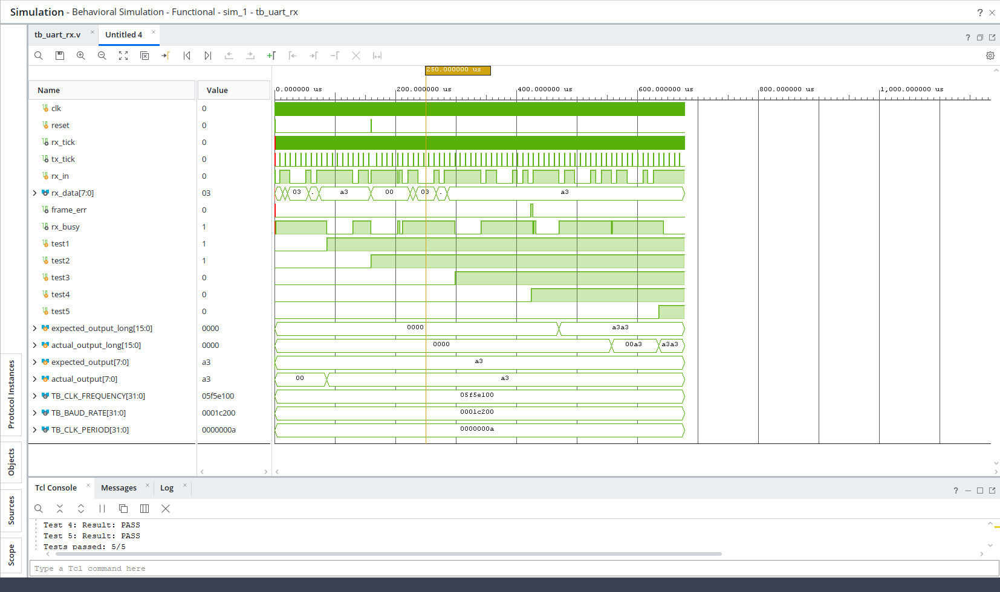

# UART Transceiver in Verilog

UART transceiver (TX/RX) in Verilog: 8-N-1, 16x oversampled, self-checking testbenches.

## Block Diagram

## Features

- 8-N-1 UART framing
- LSB-first data transmission and reception
- 16x oversampling on RX
- 2-flop synchronizer for the asynchronous RX input
- False-start rejection
- Framing error detection
- Parameterized clock frequency and baud rate
- Separate TX and RX finite-state machines
- Self-checking simulation testbenches

## Module Breakdown

| File | Description |
|---|---|
| `rtl/uart_baud_gen.v` | Generates the 16x RX oversampling tick and 1x TX baud tick |
| `rtl/uart_tx.v` | Serializes 8-bit parallel data into an 8-N-1 UART frame |
| `rtl/uart_rx.v` | Deserializes incoming UART data using 16x oversampling |
| `rtl/uart_top.v` | Top-level module connecting the baud generator, TX, and RX |
| `tb/tb_baud_gen.v` | Verification testbench for baud-rate tick generation |
| `tb/tb_uart_tx.v` | Self-checking TX verification testbench |
| `tb/tb_uart_rx.v` | Self-checking RX verification testbench |
| `tb/tb_uart_top.v` | Top-level integration and interface testbench |

## How to Run

### Prerequisites

Simulations were run using [Icarus Verilog](http://iverilog.icarus.com/):

    # Ubuntu/Debian
    sudo apt-get install iverilog

    # macOS (Homebrew)
    brew install icarus-verilog

Alternatively, all modules can be simulated in Xilinx Vivado — see "Vivado" section below.

### Running the testbenches

All commands are run from the repository root.

**Baud rate generator**

    iverilog -g2005 -o sim_baud_gen tb/tb_baud_gen.v rtl/uart_baud_gen.v
    vvp sim_baud_gen

**TX module**

    iverilog -g2005 -o sim_tx tb/tb_uart_tx.v rtl/uart_tx.v rtl/uart_baud_gen.v
    vvp sim_tx

**RX module**

    iverilog -g2005 -o sim_rx tb/tb_uart_rx.v rtl/uart_rx.v rtl/uart_baud_gen.v
    vvp sim_rx

**Top-level integration**

    iverilog -g2005 -o sim_top tb/tb_uart_top.v rtl/uart_top.v rtl/uart_rx.v rtl/uart_tx.v rtl/uart_baud_gen.v
    vvp sim_top

Each testbench is self-checking and prints PASS/FAIL results directly to the console.

### Vivado (alternative)

1. Add the files in `rtl/` to **Design Sources**.
2. Add the testbenches in `tb/` to **Simulation Sources**.
3. Select the desired testbench as the simulation top module.
4. Run **Behavioral Simulation**.

## Verification Results

The individual TX and RX modules were verified with dedicated testbenches covering normal operation and reset/error conditions.

### RX Testbench

    Test 1: Result: PASS
    Test 2: Result: PASS
    Test 3: Result: PASS
    Test 4: Result: PASS
    Test 5: Result: PASS
    Tests passed: 5/5

The RX tests cover:

- Normal 8-bit reception
- Reset during reception
- False-start rejection
- Invalid stop-bit detection
- Back-to-back frame reception

### TX Testbench

    Test 1: Result: PASS
    Test 2: Result: PASS
    Test 3: Result: PASS
    Tests passed: 3/3

The TX tests cover:

- Normal 8-bit transmission
- Reset during transmission
- Data stability during an active transmission

### Top-Level Testbench

    UART reset/idle state: PASS
    UART TX transmission: PASS
    UART RX reception: PASS

The top-level testbench verifies the integrated UART interface by independently exercising the TX and RX ports.

### Waveform

The waveform demonstrates the uart_top frame timing, and attached I/O values.

The waveform demonstrates the baud_gen frame timing, and the values of rx and tx ticks it outputs.

The waveform demonstrates the uart_tx frame timing, and the values of the data sent.

The waveform demonstrates the uart_rx frame timing, and the values of the data received.

## Known Limitations / Next Steps

- No parity-bit support
- No FIFO or buffering
- RX currently uses a single midpoint sample for each data bit
- No configurable data width or stop-bit count
- Baud-rate generation uses integer clock division, introducing a small timing error for some clock/baud-rate combinations
- No runtime baud-rate configuration

## Author

**Greec Daher**

## License

This project is licensed under the MIT License.